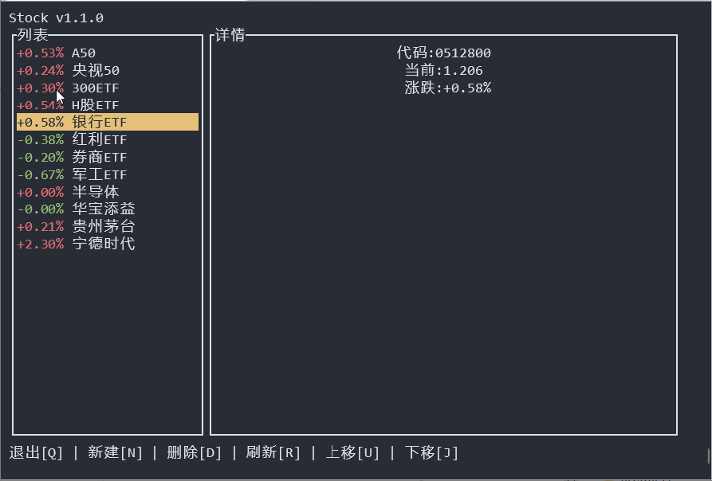

使用Rust开发的股价查询终端应用：



## 编译/运行
```
cargo build
cargo run
```


## 开发参考 (API 说明)

本软件目前使用的是 **东方财富 (East Money)** 的公开行情接口。该接口无需注册，直接返回 JSON 格式数据。

### 重构说明 (v3.0)
本项目代码已进行深度重构，优化了架构和代码清晰度：
- **架构**: 采用主线程更新 UI + 子线程获取数据 + Channel 通信的模式，消除了锁竞争。
- **模块化**: 
  - `src/model.rs`: 领域模型与 DTO 定义
  - `src/api.rs`: 封装 HTTP 请求与数据解析
  - `src/storage.rs`: 负责配置持久化
  - `src/app.rs`: 核心业务逻辑
  - `src/widget.rs`: UI 组件渲染
- **依赖**: 保持零新增依赖，体积小巧。

### 1. 接口地址
`http://push2.eastmoney.com/api/qt/ulist.np/get`

### 2. 核心参数
- `secids`: 股票唯一标识符，格式为 `市场代码.股票代码`。多个股票用逗号隔开。
  - `1`: 上海证券交易所 (SH) 6开头6位数字代码 或 900开头6位数字代码（B股）
    - 示例: `1.600519` (贵州茅台)
  - `0`: 深圳证券交易所 (SZ) 0或3开头6位数字代码 或 920开头6位数字代码（北证A股） 或 200开头6位数字代码（B股）
    - 示例: `0.000001` (平安银行)
  - `116`: 香港联合交易所 (HK) 0开头5位数字代码
    - 示例: `116.00700` (腾讯控股)
  - `105`到`107`: 美国纽约证券交易所 (NYSE) 或 纳斯达克证券交易所 (NASDAQ) 英文代码
    - 示例: `105.NVDA` (英伟达)
  - `155`: 英国伦敦证券交易所 (LSE) 英文代码
    - 示例: `155.GSK` (葛兰素史克)
- `fields`: 指定返回的字段，用逗号隔开。
  - `f2`: 最新价格 (需除以 100)
  - `f3`: 涨跌幅 % (需除以 100)
  - `f4`: 涨跌额 % (需除以 100)
  - `f5`: 成交量 (手)
  - `f6`: 成交额
  - `f7`: 振幅 % (需除以 100)
  - `f8`: 换手率 % (需除以 100)
  - `f9`: 市盈率 %（动态）（需除以 100）
  - `f10`: 量比 (需除以 100)
  - `f11`: 5分钟涨跌幅 % (需除以 100)
  - `f12`: 股票代码
  - `f13`: 市场代码
  - `f14`: 股票名称
  - `f15`: 今日最高价 (需除以 100)
  - `f16`: 今日最低价 (需除以 100)
  - `f17`: 今日开盘价 (需除以 100)
  - `f18`: 昨日收盘价 (需除以 100)
  - `f20`: 总市值
  - `f21`: 流通市值
  - `f22`: 涨速 %（需除以 100）
  - `f23`: 市净率 (需除以 100)
  - `f24`: 60日涨跌幅 % (需除以 100)
  - `f25`: 年初至今涨跌幅 % (需除以 100)

#### 注意！港股美股英股的所有价格都是需要除以1000才是正确结果

### 3. 返回格式
返回标准 JSON 结构，核心行情数据位于 `data.diff` 数组中。

### 4. 调试示例
```bash
curl "http://push2.eastmoney.com/api/qt/ulist.np/get?secids=1.600519&fields=f2,f3,f4,f5,f6,f7,f8,f9,f10,f11,f12,f13,f14,f15,f16,f17,f18,f20,f21,f22,f23,f24,f25"
```

## License

Copyright (c) 2017-present fjqz177

[MIT License](http://en.wikipedia.org/wiki/MIT_License)